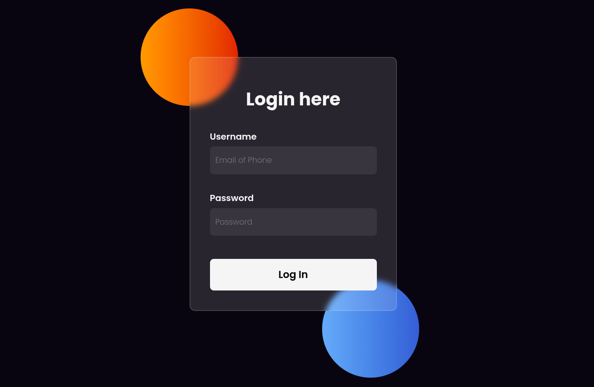

# Glassmorphism Login Page

A modern login page built with HTML5 and CSS3, featuring a glassmorphism-inspired design and responsive layout.

## ✨ Features

- Responsive design
- Flexbox layout
- Glassmorphism effect
- Gradient decorative elements
- Clean and modern UI

## 🛠️ Technologies

- HTML5
- CSS3
- Flexbox

## 📸 Preview



## 🚀 Getting Started

1. Clone the repository

```bash
git clone https://github.com/your-username/glassmorphism-login-page.git
```

2. Open `index.html` in your browser.

## 📂 Project Structure

```text
.
├── index.html
├── styles/
│   └── style.css
└── README.md
```

## 🎯 Learning Goals

This project was built to practice:

- HTML structure
- CSS styling
- Flexbox layout
- Responsive design principles
